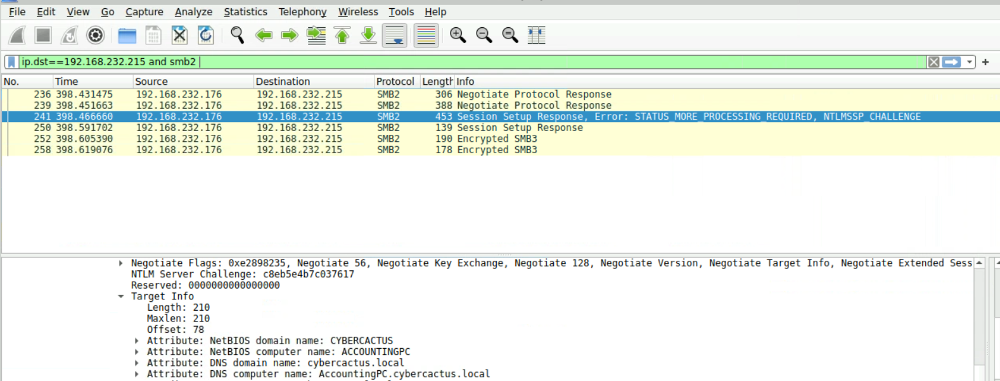

# PoisonedCredentials
**Platform:** CyberDefender | **Date:** May 2026
**Score:** 5/5

## What Was This About?
The security team detected suspicious LLMNR and NBT-NS 
poisoning attacks on the network. Someone was intercepting 
network traffic to steal user credentials. My job was to 
dig through the PCAP file and figure out what happened.

## Tools I Used
- Wireshark

## How I Investigated

**Step 1 - Finding the mistyped query**
I filtered for LLMNR traffic in Wireshark using:
ip.src == 192.168.232.162
I found the machine was querying for "fileshaare" which 
is a mistyped hostname. This is what triggered the attack 
because the attacker responded to the broadcast.

**Step 2 - Finding the rogue machine**
I looked at who responded to the LLMNR query. Using:
udp.port == 5355
I could see the rogue machine was 192.168.232.215 
pretending to be the requested host.

**Step 3 - Finding the second victim**
I checked all machines that received poisoned responses 
from 192.168.232.215 and found 192.168.232.176 was also 
targeted.

**Step 4 - Finding the compromised account**
I filtered SMB2 traffic to the rogue machine using:
ip.dst == 192.168.232.215 and smb2
I followed the authentication stream and found the 
username janesmith in the NTLMSSP authentication.

**Step 5 - Finding the accessed hostname**
Still using the same filter I clicked on the Session 
Setup Response packet containing the NTLMSSP Challenge. 
I expanded Security Blob then GSS-API then NTLMSSP then 
Target Info and found the DNS computer name was 
AccountingPC.

## What I Found
- **Mistyped query:** fileshaare
- **Rogue machine IP:** 192.168.232.215
- **Second victim IP:** 192.168.232.176
- **Compromised account:** janesmith
- **Accessed hostname:** AccountingPC

## What I Learned
This was my first time investigating an LLMNR poisoning 
attack. I learned how attackers exploit mistyped hostnames 
to steal credentials. Getting comfortable with Wireshark 
filters and expanding packet details to find hidden 
information was really valuable practice.
